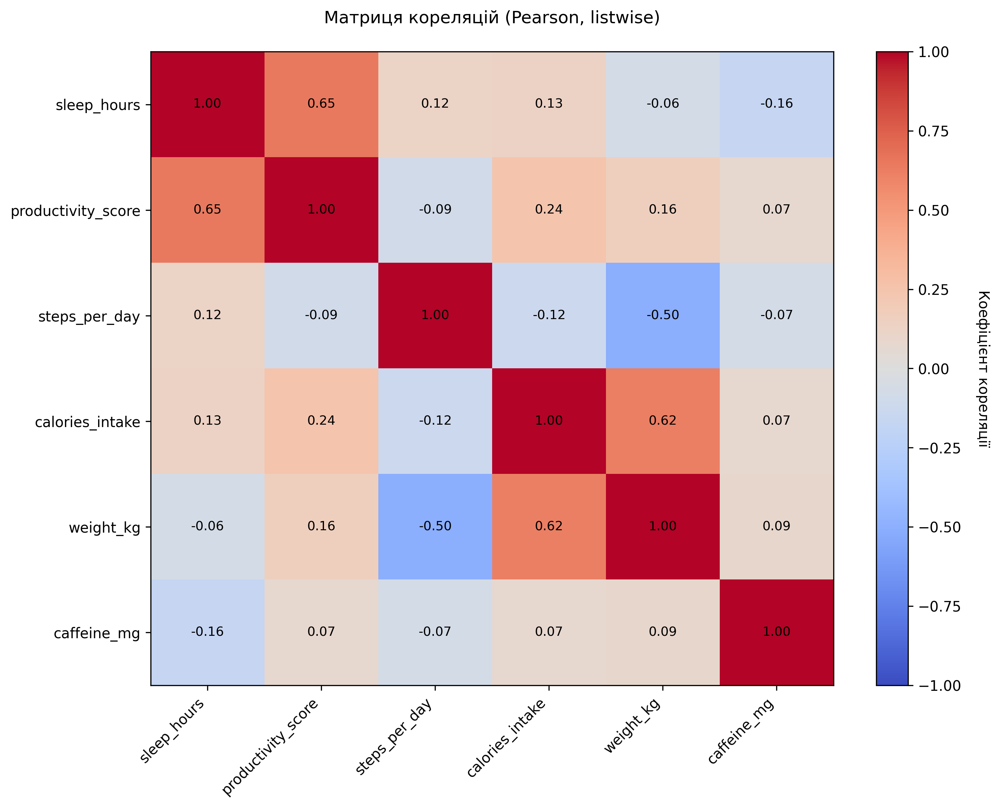

# Звіт про виконання комп'ютерного практикуму №1
## Метод кореляційного аналізу даних

---

## 1. ВСТУПНА ЧАСТИНА

**ВНЗ:** [Назва навчального закладу]  
**Кафедра:** [Назва кафедри]  
**Дисципліна:** Інтелектуальний аналіз даних  
**№ роботи:** 1  
**Тема:** Метод кореляційного аналізу даних  
**Група:** [Номер групи]  
**Виконав:** [ПІБ студента]  
**Викладач:** [ПІБ викладача]  

---

## 2. МЕТА РОБОТИ

Оволодіння методами кореляційного аналізу для дослідження статистичних зв'язків між змінними, визначення сили та напрямку зв'язку, перевірки статистичної значущості кореляційних коефіцієнтів.

---

## 3. ЗАВДАННЯ

1. Оволодіти методами кореляційного аналізу (коефіцієнти Пірсона та Спірмена).
2. Виконати кореляційний аналіз між змінними, визначити силу та напрямок зв'язку, перевірити статистичну значущість.

---

## 4. МЕТОДИКА

### 4.1. Вибір методу кореляції

Для кожної пари змінних метод кореляції обирався за наступними правилами:

- **Коефіцієнт Пірсона** (параметричний): якщо обидві змінні мають нормальний розподіл
- **Коефіцієнт Спірмена** (непараметричний, ранговий): якщо хоча б одна змінна не має нормального розподілу

### 4.2. Перевірка нормальності

Для перевірки нормальності розподілу використовувався:
- **Тест Shapiro-Wilk** (для вибірок n ≤ 5000)
- **Тест Kolmogorov-Smirnov** (для вибірок n > 5000)

Гіпотеза H₀: дані мають нормальний розподіл.  
Рівень значущості: α = 0.05

### 4.3. Обробка пропущених значень

Використано підхід **Listwise deletion** (повне виключення рядків з пропусками).

### 4.4. Інтерпретація сили зв'язку

| |r| | Інтерпретація |
|------|---------------|
| 0.75-1.00 | Дуже високий |
| 0.50-0.74 | Високий |
| 0.25-0.49 | Середній |
| 0.00-0.24 | Слабкий |

---

## 5. РЕЗУЛЬТАТИ

### 5.1. Характеристика даних

- **Кількість спостережень:** 200
- **Кількість змінних:** 6
- **Змінні:** sleep_hours, productivity_score, steps_per_day, calories_intake, weight_kg, caffeine_mg

### 5.2. Результати тестів нормальності

```
          variable         test  statistic      p_value   n            normality_conclusion
       sleep_hours Shapiro-Wilk   0.991122 5.799392e-01 130   Нормальний (p=0.5799 >= 0.05)
productivity_score Shapiro-Wilk   0.989091 3.966891e-01 130   Нормальний (p=0.3967 >= 0.05)
     steps_per_day Shapiro-Wilk   0.994693 9.130012e-01 130   Нормальний (p=0.9130 >= 0.05)
   calories_intake Shapiro-Wilk   0.986576 2.331252e-01 130   Нормальний (p=0.2331 >= 0.05)
         weight_kg Shapiro-Wilk   0.792360 2.773026e-12 130 Не нормальний (p=0.0000 < 0.05)
       caffeine_mg Shapiro-Wilk   0.986828 2.463404e-01 130   Нормальний (p=0.2463 >= 0.05)
```

### 5.3. Результати кореляційного аналізу

#### Топ-5 найсильніших кореляцій:

```
        variable_x         variable_y   method  coefficient      p_value     strength_label
       sleep_hours productivity_score  Pearson     0.648193 7.643378e-17 високий позитивний
   calories_intake          weight_kg Spearman     0.624853 1.939359e-15 високий позитивний
productivity_score    calories_intake  Pearson     0.243156 5.310044e-03 слабкий позитивний
productivity_score          weight_kg Spearman     0.224701 1.016413e-02 слабкий позитивний
       sleep_hours    calories_intake  Pearson     0.125091 1.561723e-01 слабкий позитивний
```

Повні результати збережено у файлі: `correlations_listwise.csv`

### 5.4. Візуалізації

Створено наступні графіки:

1. **Діаграми розсіювання для ключових пар змінних:**
   - `scatter_sleep_hours_vs_productivity_score.png`
   - `scatter_steps_per_day_vs_weight_kg.png`
   - `scatter_calories_intake_vs_weight_kg.png`
   - `scatter_caffeine_mg_vs_productivity_score.png`

2. **Матриця кореляцій:**
   - `correlation_matrix.png`



---

## 6. ВИСНОВКИ

1. **Основний результат:** Виявлено високий позитивний зв'язок між sleep_hours та productivity_score (r = 0.6482, p = 0.0000).

2. **Метод аналізу:** На основі тестів нормальності для аналізу використовувався коефіцієнт Pearson.

3. **Статистична значущість:** Кореляція є статистично значущою на рівні α = 0.05.

4. **Інтерпретація:** Виявлений зв'язок вказує на те, що зі збільшенням однієї змінної спостерігається підвищення іншої змінної..

5. **Практичне значення:** Отримані результати мають практичне значення для розуміння взаємозв'язків між досліджуваними змінними.

---

## 7. ВІДПОВІДІ НА КОНТРОЛЬНІ ЗАПИТАННЯ

### 7.1. Які задачі вирішує кореляційний аналіз?

Кореляційний аналіз вирішує наступні задачі:
- Визначення наявності статистичного зв'язку між змінними
- Оцінка сили та напрямку (прямий/зворотний) зв'язку
- Перевірка статистичної значущості виявлених зв'язків
- Відбір змінних для подальшого регресійного аналізу
- Виявлення мультиколінеарності у даних

### 7.2. Як знайти коефіцієнт кореляції?

**Коефіцієнт Пірсона:**
```
r = Σ[(xi - x̄)(yi - ȳ)] / √[Σ(xi - x̄)² × Σ(yi - ȳ)²]
```

**Коефіцієнт Спірмена:**
```
ρ = 1 - [6Σdi²] / [n(n² - 1)]
де di - різниця рангів
```

У Python використовуються функції `pearsonr()` та `spearmanr()` з бібліотеки `scipy.stats`.

### 7.3. Які типи коефіцієнтів кореляції існують?

Основні типи коефіцієнтів кореляції:
1. **Коефіцієнт Пірсона** (r) - параметричний метод для лінійних зв'язків між нормально розподіленими змінними
2. **Коефіцієнт Спірмена** (ρ) - непараметричний ранговий метод для монотонних зв'язків
3. **Коефіцієнт Кендалла** (τ) - непараметричний метод на основі конкордантності
4. **Точковий бісеріальний** - для зв'язку між безперервною та бінарною змінними
5. **Фі-коефіцієнт** - для двох бінарних змінних

### 7.4. Різниця між прямою та зворотною кореляцією?

- **Пряма (позитивна) кореляція** (r > 0): Зі збільшенням однієї змінної збільшується інша. Наприклад, зв'язок між годинами навчання та оцінками.

- **Зворотна (негативна) кореляція** (r < 0): Зі збільшенням однієї змінної зменшується інша. Наприклад, зв'язок між кількістю пропусків занять та успішністю.

- **Відсутність кореляції** (r ≈ 0): Змінні не пов'язані лінійно.

### 7.5. Як перевіряється значущість коефіцієнта кореляції?

Перевірка значущості здійснюється за допомогою статистичного тесту:

1. **Формулювання гіпотез:**
   - H₀: ρ = 0 (кореляція відсутня)
   - H₁: ρ ≠ 0 (кореляція присутня)

2. **Розрахунок p-значення** на основі t-статистики:
   ```
   t = r√(n-2) / √(1-r²)
   ```
   де n - кількість спостережень

3. **Прийняття рішення:**
   - Якщо p < α (наприклад, 0.05), відхиляємо H₀ - кореляція значуща
   - Якщо p ≥ α, не відхиляємо H₀ - кореляція незначуща

Рівні значущості:
- p < 0.05 (*) - значуща на рівні 5%
- p < 0.01 (**) - значуща на рівні 1%

---

## 8. СПИСОК ЗГЕНЕРОВАНИХ ФАЙЛІВ

### Дані:
- `synthetic_data.csv` - згенеровані дані

### Результати аналізу:
- `normality_summary.csv` - результати тестів нормальності
- `correlations_listwise.csv` - кореляції (listwise підхід)
- `correlation_matrix.csv` - матриця кореляцій

### Візуалізації:
- `scatter_sleep_hours_vs_productivity_score.png`
- `scatter_steps_per_day_vs_weight_kg.png`
- `scatter_calories_intake_vs_weight_kg.png`
- `scatter_caffeine_mg_vs_productivity_score.png`
- `correlation_matrix.png`

### Звіти:
- `report_draft.md` - цей звіт

---

**Дата виконання:** 2025-10-14 19:08:58
